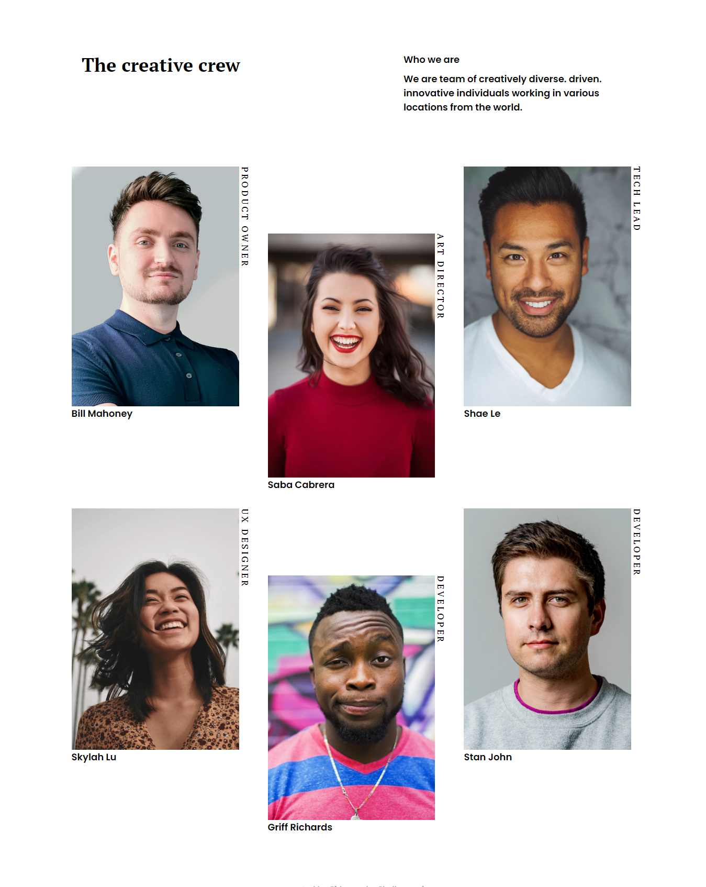

<!-- Please update value in the {}  -->

<h1 align="center">My Team page</h1>

   Solution for a challenge from  <a href="http://devchallenges.io" target="_blank">Devchallenges.io</a>.

  <h3>
    <a href="https://my-team-challenges-q2wo.vercel.app/">
      Demo
    </a>
     | 
    <a href="https://{your-url-to-the-solution}">
      Solution
    </a>
     | 
    <a href="https://devchallenges.io/challenges/hhmesazsqgKXrTkYkt0U">
      Challenge
    </a>
  </h3>

<!-- TABLE OF CONTENTS -->

## Table of Contents

- [Overview](#overview)
  - [Built With](#built-with)
- [Contact](#contact)

<!-- OVERVIEW -->

## Overview

Introduce your projects by taking a screenshot or a gif. Try to tell visitors a story about your project by answering:

- What was your experience?
  The project was little bit hard. I had to figure out how to position the middle items like that. But as they say every challenge means new opportunity to learn. I learnt about the [nth-child](https://developer.mozilla.org/en-US/docs/Web/CSS/:nth-child) pesudo class. And my problem was solved

### Built With

<!-- This section should list any major frameworks that you built your project using. Here are a few examples.-->

- [React](https://reactjs.org/)
- [Styled Component](https://styled-components.com/)

## Contact

- GitHub [@gideon-del](https://github.com/gideon-del)
- Twitter [@ChidiGideon6](https://twitter.com/ChidiGideon6)
